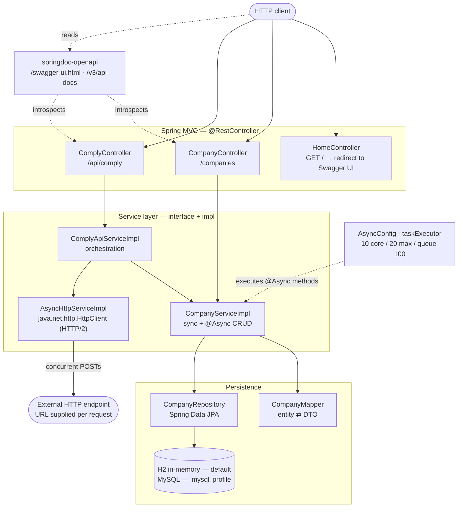

# COMPLY API Blueprint

[](https://github.com/mjh5153/comply-api-blueprint/actions/workflows/ci.yml)

> **Status: technical blueprint / prototype — not a compliance product.**
>
> This repository is a small, readable Spring Boot codebase that works out the
> *service and concurrency shape* for a compliance-data API. It contains **no
> compliance rules, no regulatory logic, and no legal validation of any kind**,
> and it has never been deployed to a production environment. Nothing here
> constitutes legal or regulatory advice. The endpoints named `comply` are
> orchestration scaffolding — see
> [What this prototype demonstrates](#what-this-prototype-demonstrates) for a
> precise account of what is and isn't implemented.

---

## The business problem

Regulatory and compliance workflows push entity data (companies, filings,
registrations) back and forth between an internal system of record and one or
more **third-party APIs** — registries, screening vendors, government
endpoints. That workload has an awkward shape:

- **Submissions arrive in batches**, not one at a time. An onboarding run or a
  periodic refresh means hundreds of records at once.
- **The slow part is someone else's network.** Latency is dominated by external
  calls the service does not control and cannot speed up.
- **Results must be reconciled**, because a batch partially succeeds: some
  records land, some fail, and the caller needs an accounting of which.

Handled naively — a blocking call per record on the request thread — the
servlet pool spends its life parked on external I/O, and throughput collapses
well before CPU or database capacity is the constraint.

This repository is a blueprint for the API layer that sits in front of that
problem: how the controllers, services, and thread pools should be arranged so
the request thread is released while external work is in flight.

## What this prototype demonstrates

**What is implemented and verified** (exercised by the test suite and by live
`curl` against a running instance):

- A complete CRUD resource (`/companies`) in both blocking and
  `CompletableFuture`-returning variants, sharing one service and persistence
  layer.
- Real concurrent outbound HTTP fan-out via `java.net.http.HttpClient`
  (HTTP/2, 10 s connect timeout), aggregated with `CompletableFuture.allOf`.
- A custom `@Async` executor (10 core / 20 max threads, 100-item queue) and
  verified evidence of which endpoints actually use it — see
  [Concurrency design](#concurrency-design).
- Layered separation: controller → service interface → implementation → mapper
  → repository → JPA entity → DTO record, with constructor injection throughout.
- Error mapping: `ResourceNotFoundException` → `404`; `.exceptionally(...)` on
  async chains → `500`.
- OpenAPI 3 generated from the controllers, served at `/swagger-ui.html`.

**What the architecture demonstrates rather than delivers:** the `/api/comply`
endpoints show *where* compliance orchestration would attach — a request enters,
fans out to an external endpoint supplied by the caller, and a reconciliation
step summarises the responses. The reconciliation implementation counts
non-empty response strings. It does not parse, validate, or interpret them.

**What is deliberately absent:** compliance rules, a rule engine, external
registry integrations, authentication, authorization, request validation,
transaction boundaries, retries, rate limiting, and persistence beyond an
in-memory default. See
[Production considerations](#prototype-limitations-and-production-considerations).

## Architecture



The diagram shows every component that participates in a request. One class in
the repository does **not** appear because nothing calls it:
`util/ConcurrentFileWriter` is a standalone `ReentrantLock`-guarded file-append
helper, not wired into any request path.

## Implemented capabilities

| Capability | Where | Notes |
|---|---|---|
| Sync CRUD for `Company` | `CompanyController`, `CompanyServiceImpl` | Create / read / update / delete |
| Async CRUD variants | same | Return `CompletableFuture<ResponseEntity<T>>` |
| Batch create | `POST /companies/batch/async` | Per-item futures joined with `allOf` |
| Concurrent outbound HTTP | `AsyncHttpServiceImpl` | HTTP/2, `sendAsync`, `allOf` aggregation |
| Response reconciliation | `ComplyApiServiceImpl` | Counts non-null, non-empty responses |
| Custom thread pool | `AsyncConfig` | 10/20/100, `Async-` thread prefix |
| 404 / 500 mapping | `ResourceNotFoundException`, `.exceptionally` | |
| OpenAPI 3 + Swagger UI | `OpenApiConfig`, springdoc | Generated from controllers |
| Root redirect | `HomeController` | `/` → `/swagger-ui/index.html` |
| H2 default, MySQL profile | `application*.properties` | DB credentials from env vars only |
| Unit + integration tests | `src/test/java/…` | 17 tests, Mockito + MockMvc |
| Container build | `Dockerfile` | Multi-stage, non-root, slim JRE |
| CI | `.github/workflows/ci.yml` | `mvn -B verify` on push / PR |

## Technology stack

| Layer       | Technology                                                    |
|-------------|---------------------------------------------------------------|
| Runtime     | Java 17+, Spring Boot 3.5.6                                   |
| Web         | Spring Web MVC, Jackson                                       |
| Persistence | Spring Data JPA, Hibernate 6.6, H2 (default) / MySQL          |
| Async       | `CompletableFuture`, Spring `@Async`, `ThreadPoolTaskExecutor` |
| Docs        | springdoc-openapi 2.6.0 (OpenAPI 3 + Swagger UI)              |
| Build       | Maven                                                         |
| Tests       | JUnit 5, Mockito, Spring Boot Test, MockMvc, AssertJ          |

## Build, test, and run

### Prerequisites

**JDK 17+** and **Maven 3.6+**. This repository has no `mvnw` wrapper, so Maven
must be installed.

On macOS, via [Homebrew](https://docs.brew.sh/Installation):

```bash
# Install Homebrew if you don't have it
/bin/bash -c "$(curl -fsSL https://raw.githubusercontent.com/Homebrew/install/HEAD/install.sh)"

# Homebrew then prints the two lines needed to add it to your PATH, e.g.
#   echo 'eval "$(/usr/local/bin/brew shellenv)"' >> ~/.zprofile
#   eval "$(/usr/local/bin/brew shellenv)"

brew install openjdk maven
```

### Build and test

```bash
mvn clean verify
```

### Run

```bash
mvn spring-boot:run
```

or run the packaged jar:

```bash
mvn clean package
java -jar target/demo-0.0.1-SNAPSHOT.jar
```

The app starts on **http://localhost:8080** backed by an in-memory H2 database.
No configuration, credentials, or external services are required. Data is
discarded when the process exits.

- Swagger UI → **http://localhost:8080/swagger-ui.html**
- OpenAPI 3 JSON → **http://localhost:8080/v3/api-docs**

### MySQL profile (optional)

Credentials are read from environment variables; nothing sensitive is committed.

```bash
export DB_URL=jdbc:mysql://localhost:3306/ems
export DB_USERNAME=your_user
export DB_PASSWORD=your_password
mvn spring-boot:run -Dspring-boot.run.profiles=mysql
```

### Container

```bash
docker build -t comply-api-blueprint .
docker run --rm -p 8080:8080 comply-api-blueprint
```

The multi-stage `Dockerfile` builds with Maven + JDK 17 and ships an
`eclipse-temurin:17-jre-alpine` runtime running as a non-root user.

### Deployment status

**This service is not deployed anywhere, and no hosted instance exists.**

A `render.yaml` blueprint is included and the application is deployment-shaped —
it reads `$PORT` (`server.port=${PORT:8080}`), needs no secrets under its
default H2 profile, and builds from the committed `Dockerfile`. Standing up an
actual instance requires a Render account and provisioning outside this
repository, so it has not been done and is not claimed. Anyone wanting a live
instance can point Render's **New + → Blueprint** flow at a fork; note that the
default profile's H2 database is in-memory, so a hosted instance would lose all
data on restart, and a persistent deployment would need the MySQL profile plus a
provisioned database.

## API

Base URL `http://localhost:8080`. All request and response bodies are JSON.
Every example below was executed against a running instance; the status codes
shown are the observed responses.

### `CompanyController` — `/companies`

| Method | Path                      | Response | Description                          |
|--------|---------------------------|----------|--------------------------------------|
| GET    | `/companies`              | `200`    | List all companies                   |
| GET    | `/companies/{id}`         | `200` / `404` | Get by id                       |
| POST   | `/companies`              | `201`    | Create (blocking)                    |
| PUT    | `/companies/{id}`         | `200`    | Update (blocking)                    |
| DELETE | `/companies/{id}`         | `204`    | Delete                               |
| POST   | `/companies/async`        | `201`    | Create on the async pool             |
| POST   | `/companies/batch/async`  | `201`    | Batch create, futures joined by `allOf` |
| PUT    | `/companies/{id}/async`   | `200`    | Update, non-blocking dispatch        |

### `ComplyController` — `/api/comply`

| Method | Path                                  | Response | Description                              |
|--------|---------------------------------------|----------|------------------------------------------|
| POST   | `/api/comply/process`                 | `201`    | Persist one record on the async pool     |
| POST   | `/api/comply/process/batch`           | `201`    | Persist a batch                          |
| POST   | `/api/comply/external-api/concurrent`  | `200`    | Fan out concurrent POSTs to `?apiEndpoint=` |
| POST   | `/api/comply/reconcile`               | `200`    | Summarise a list of response strings     |

### Examples

```bash
# Create — 201
curl -s -X POST http://localhost:8080/companies \
  -H 'Content-Type: application/json' \
  -d '{"id":null,"name":"Acme","email":"acme@example.com"}'
# {"id":1,"name":"Acme","email":"acme@example.com"}

# List — 200
curl -s http://localhost:8080/companies
# [{"id":1,"name":"Acme","email":"acme@example.com"}]

# Unknown id — 404
curl -s -o /dev/null -w '%{http_code}\n' http://localhost:8080/companies/999999

# Batch create — 201
curl -s -X POST http://localhost:8080/companies/batch/async \
  -H 'Content-Type: application/json' \
  -d '[{"id":null,"name":"B1","email":"b1@x.com"},{"id":null,"name":"B2","email":"b2@x.com"}]'
# [{"id":2,"name":"B1",...},{"id":3,"name":"B2",...}]

# Reconcile a set of responses — 200
curl -s -X POST http://localhost:8080/api/comply/reconcile \
  -H 'Content-Type: application/json' \
  -d '["{\"status\":\"ok\"}","{\"status\":\"ok\"}"]'
# Reconciliation complete: 2/2 responses processed
```

> **Breaking change:** the company resource was previously mounted at
> `/companys`. It is now `/companies`. No compatibility alias is provided — the
> old path returns `404`. The JPA table is still named `companys`; that is an
> internal schema detail and was left unchanged.

## Concurrency design

The async layer is the part of this blueprint worth reading closely, including
where it currently falls short.

**Thread hand-off.** Async service methods are annotated `@Async` and return
`CompletableFuture<T>`, scheduled onto the `taskExecutor` bean in `AsyncConfig`
(10 core / 20 max threads, 100-item queue, `Async-` name prefix). Controllers
return `CompletableFuture<ResponseEntity<T>>`, so Spring MVC releases the
servlet thread and completes the response when the future resolves.

**Fan-out and aggregation.** `AsyncHttpServiceImpl` builds one `HttpRequest`
per entry, dispatches them all with `sendAsync`, and joins them with
`CompletableFuture.allOf(...)` before mapping each result — the requests are
genuinely in flight simultaneously.

**Error propagation.** Async chains terminate in `.exceptionally(...)` at the
controller, converting a failed stage into a `500` rather than a leaked
exception. `ResourceNotFoundException` carries `@ResponseStatus(NOT_FOUND)`.

**Verified execution threads.** Running the app with
`--logging.level.org.hibernate.SQL=DEBUG` and watching which thread issues each
`insert` shows exactly where work lands:

| Endpoint | Thread observed | Meaning |
|---|---|---|
| `POST /companies` | `nio-8080-exec-6` | Blocking, on the request thread — as intended |
| `POST /companies/async` | `Async-1` | Dispatched to `taskExecutor` — hand-off works |
| `POST /api/comply/process` | `Async-3` | Cross-bean call, proxy applies |
| `POST /companies/batch/async` | `nio-8080-exec-2` (both inserts) | **Runs on the request thread** |
| `POST /api/comply/reconcile` | `ForkJoinPool.commonPool` worker | Not the configured pool |

Two of those deserve comment, because they are the classic `@Async` traps:

1. **The batch endpoint does not currently run in parallel.**
   `createCompaniesAsync` is not itself `@Async` and calls `this.createCompanyAsync(...)`.
   Self-invocation bypasses the Spring AOP proxy, so the `@Async` annotation has
   no effect and every item is persisted sequentially on the caller's thread.
   The `allOf` aggregation is structurally correct and would parallelise as soon
   as the calls go through the proxy; the wiring is what's missing.
2. **`reconcileApiResponses` uses `CompletableFuture.supplyAsync(...)` with no
   executor argument**, so it runs on the JVM's common `ForkJoinPool` rather
   than the pool `AsyncConfig` defines.

Both are left as-is here rather than quietly fixed, so that the documented
behaviour matches the committed code.

## Prototype limitations and production considerations

Accurate scope, stated plainly. This codebase would need all of the following
before it could carry real traffic:

- **No compliance logic.** No rules, no regulatory validation, no registry
  integrations. The `comply` naming describes intent, not capability.
- **The batch path is not actually parallel** — see above.
- **No authentication or authorization.** Every endpoint is fully open.
- **No request validation.** `spring-boot-starter-validation` is on the
  classpath but no constraints are declared and no handler uses `@Valid`;
  malformed or missing fields are not rejected.
- **No transaction boundaries.** Nothing is annotated `@Transactional`, so a
  partially-failed batch leaves partial writes.
- **`external-api/concurrent` posts to a caller-supplied URL** with no
  allow-list, timeout budget beyond the connect timeout, retry, or circuit
  breaker — server-side request forgery is unaddressed.
- **Persistence defaults to in-memory H2** with `ddl-auto=update`; there are no
  schema migrations (Flyway/Liquibase) and no seeded data.
- **No observability.** No metrics, tracing, health endpoints beyond the
  container default, or structured logging.
- **Tests cover the layers, not the concurrency.** 17 tests verify CRUD
  behaviour, error mapping, and service orchestration. There is no load test
  and no test asserting which thread executes what; the table above was
  produced by manual inspection of a running instance.
- **`ConcurrentFileWriter` is dead code** — thread-safe and functional, but
  nothing calls it.

## Repository layout

```
src/main/java/io/github/mjh5153/complyapi/
├── DemoApplication.java          # Spring Boot entry point
├── controller/
│   ├── CompanyController.java    # /companies (sync + async CRUD)
│   ├── ComplyController.java     # /api/comply (orchestration endpoints)
│   └── HomeController.java       # / → Swagger UI
├── service/
│   ├── CompanyService.java
│   ├── ComplyApiService.java
│   ├── AsyncHttpService.java
│   └── impl/                     # implementations
├── repository/CompanyRepository.java
├── mapper/CompanyMapper.java
├── entity/Company.java           # JPA entity (table: companys)
├── dto/CompanyDTO.java           # immutable record DTO
├── exception/ResourceNotFoundException.java
├── config/
│   ├── AsyncConfig.java          # taskExecutor thread pool
│   └── OpenApiConfig.java        # OpenAPI metadata
└── util/ConcurrentFileWriter.java  # standalone, not wired in

src/main/resources/
├── application.properties        # H2 defaults
└── application-mysql.properties  # opt-in MySQL profile

src/test/java/…                   # Mockito unit + MockMvc integration tests
```

## License

MIT
