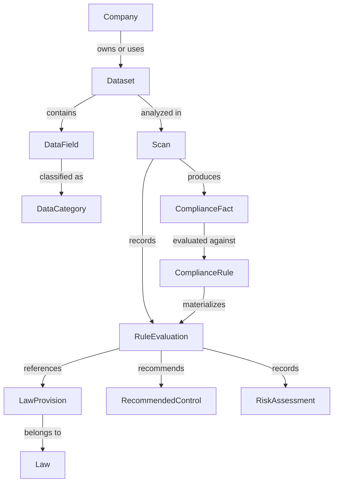
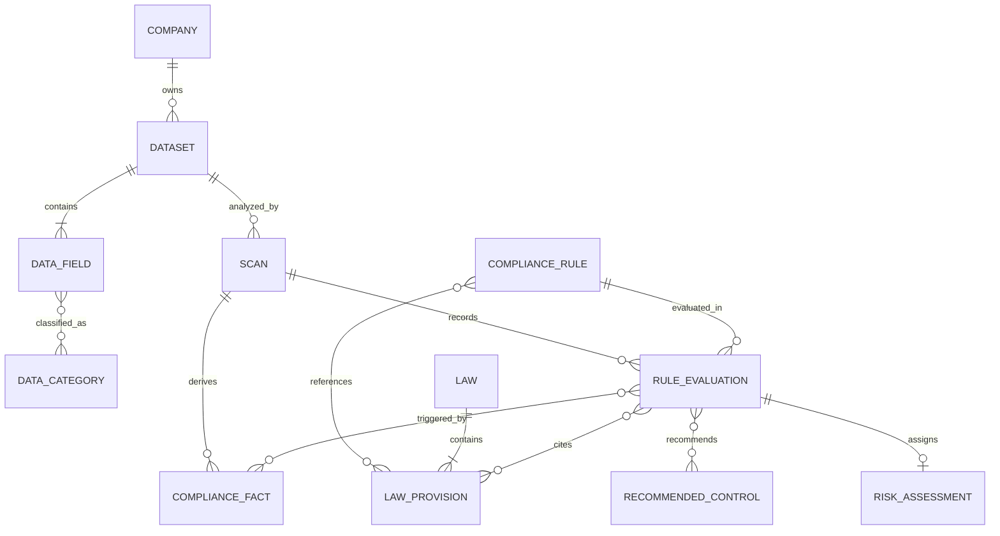
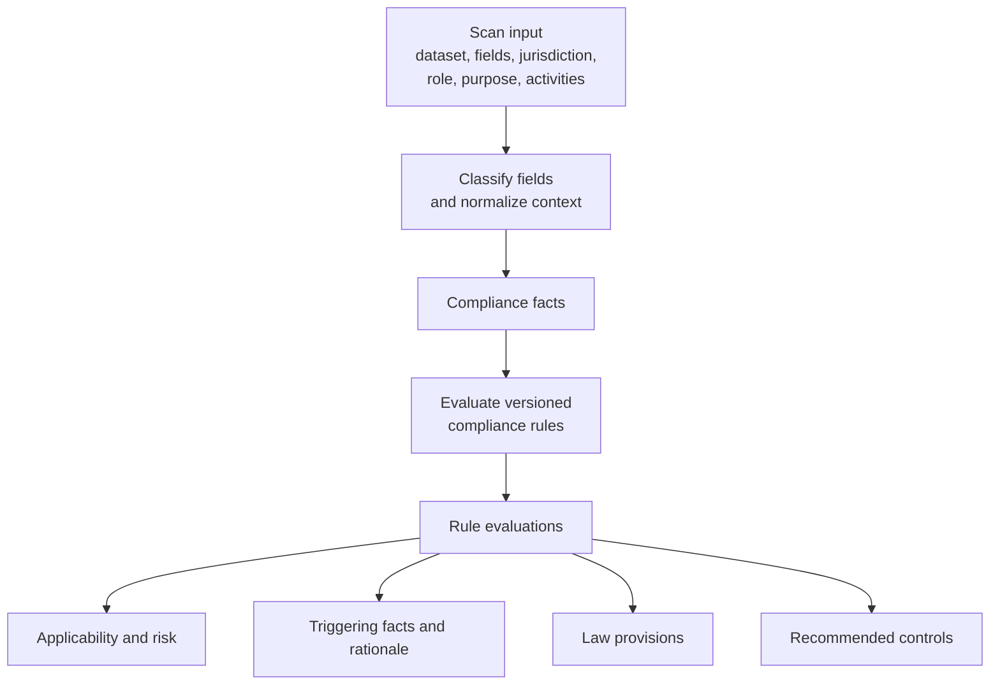
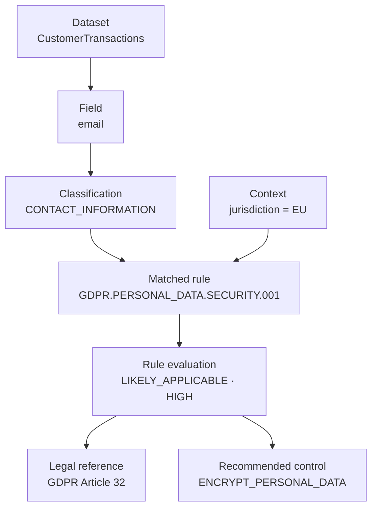

# Comply API domain model

> **Status:** Target-state domain architecture. The current blueprint persists
> `Company` records and demonstrates asynchronous processing; the remaining
> domain types in this document describe the intended dataset-to-law mapping
> model and are not yet implemented as entities or API contracts.

## Modeling principles

- A `Company` owns or uses datasets; it does not own compliance rules.
- `ComplianceRule` belongs to a versioned engine rule catalog.
- Dataset metadata and field classifications become `ComplianceFact` values.
- `RuleEvaluation` is the evidence-bearing object that connects a scan,
  matched rule, legal references, risk, triggering facts, and controls.
- Legal traceability resolves to a `LawProvision` such as GDPR Article 32,
  while `LawProvision` belongs to the broader `Law`.
- Engine findings, analyst decisions, and AI explanations remain separate
  concerns. This document models the authoritative engine path.

## 1. Core domain graph

This graph shows ownership and evaluation. The company is the business context;
the rule catalog remains independent and is applied when scan facts satisfy rule
conditions.



## 2. Target entity relationships

Cardinalities express the target conceptual model, not the current database
schema. Persistence boundaries should be chosen during implementation rather
than inferred mechanically from this diagram.



## 3. Dataset-to-law evaluation flow

The engine first converts supplied metadata into normalized facts. Rules consume
those facts and emit evidence-backed evaluations; laws are references attached
to matched rules, not mutable properties owned by a company.



## 4. Evidence and traceability example

This example illustrates how a future investigator can answer “Why did Comply
map GDPR Article 32?” without treating an AI explanation as a new compliance
determination.



## 5. Aggregate responsibilities

| Aggregate or concept | Responsibility | Ownership rule |
|---|---|---|
| `Company` | Organization using Comply | Owns datasets—not rules |
| `Dataset` | Schema and processing context under analysis | Belongs to a company |
| `DataField` / `DataCategory` | Field metadata and normalized classifications | Produces facts used by rules |
| `Scan` | Immutable analysis execution and version context | Connects input, facts, and evaluations |
| `ComplianceRule` | Versioned condition and mapping logic | Belongs to the engine rule catalog |
| `Law` / `LawProvision` | Regulation and citation-level reference | Referenced by rules and evaluations |
| `RuleEvaluation` | Evidence object for one rule result | Connects scan, rule, facts, legal references, risk, and controls |
| `RecommendedControl` | Action recommended by an evaluation | Does not itself constitute legal applicability |

## 6. Current-to-target implementation map

| Concept | Current repository status | Target role |
|---|---|---|
| `Company` | Implemented as a JPA entity and DTO | Organization boundary |
| `Dataset` | Not implemented | Unit of data being analyzed |
| `DataField` / `DataCategory` | Not implemented | Schema metadata and classification |
| `Scan` / `ComplianceFact` | Not implemented | Immutable analysis input and normalized evidence |
| `ComplianceRule` | Not implemented | Versioned rule-catalog entry |
| `Law` / `LawProvision` | Not implemented | Legal source and citation |
| `RuleEvaluation` | Not implemented | Authoritative, traceable engine result |
| `RiskAssessment` / `RecommendedControl` | Not implemented | Evaluation outputs |

## Key invariant

The core relationship is:

```text
Company -> Dataset -> Scan -> ComplianceFact
                              |
                              v
                       ComplianceRule
                              |
                              v
                       RuleEvaluation
                         /    |     \
                LawProvision Risk  Control
```

It is deliberately **not** `Company -> ComplianceRule -> Law[]`. Rules are
shared engine assets. Applicability is established only through a traceable
`RuleEvaluation` produced from a specific scan and its facts.
